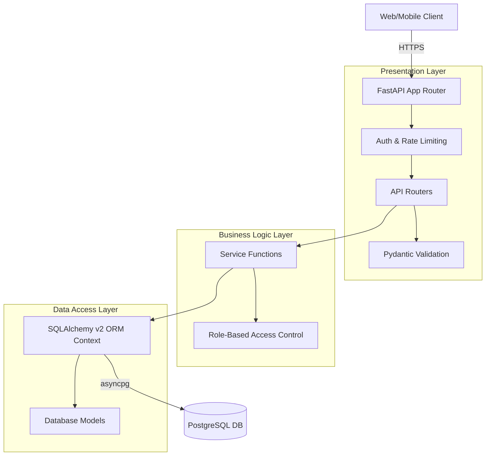

# System Architecture 

This system represents a robust, asynchronous API backend designed for a Finance Dashboard. It adheres to **Clean Architecture Principles**, ensuring that HTTP transport logic is fully decoupled from core business logic using dependency injection.

## High-Level Diagram

## Core Components & Functionality

### 1. Presentation & Transport (FastAPI)
- Uses `APIRouter` to compartmentalize endpoints (`/auth`, `/users`, `/records`, `/dashboard`).
- **Validation**: Strict boundary protection using Pydantic `v2`. Incoming requests use `*Create` and `*Update` schemas. Outgoing responses use `*Out` schemas to guarantee sensitive data (like password hashes) cannot leak.
- **Exception Handling**: Global exception catchers cleanly map 1. SQLAlchemy errors, 2. Pydantic validation failures, and 3. Business logic `ValueErrors` to the appropriate `4xx` and `5xx` HTTP responses.

### 2. Middleware & Security layer
- **Authentication**: `HTTPBearer` catches authorization headers. `python-jose` decodes stateless JWTs.
- **RBAC Engine**: The `require_role(allowed_roles)` dependency factory guards routers based on standard matrix definitions (`VIEWER`, `ANALYST`, `ADMIN`).
- **Rate Limiting**: Implementation of `slowapi` strictly limits burst traffic preventing brute-forcing on `/auth/login`.

### 3. Business Service Layer
- **Zero Framework Coupling**: The `services/` directory contains no FastAPI imports. This ensures core financial math and assertions can be unit tested without starting a web server.
- **Dashboard Aggregations**: Does not pull arrays into Python memory. Instead, it pushes aggregate operations directly to the Database Engine using optimized `sqlalchemy.func` functions (e.g., `func.sum`, `func.coalesce`).

### 4. Data Access (PostgreSQL + Asyncpg)
- **Engine**: Powered strictly by `asyncpg`, handling concurrent requests without thread-blocking.
- **Relationships**: Normalized schemas. A `FinancialRecord` uses a `category_id` foreign key mapped to `Categories`.
- **Query Optimization**: Advanced filtering and dashboard aggregations (such as fetching items by date ranges or types) are heavily optimized via explicit PostgreSQL B-Tree indexes: `idx_records_date`, `idx_records_type`, and `idx_records_deleted_at`.
- **Soft Deletion Strategy**: Data isn't erased. Records are tombstoned using the `deleted_at` timestamp. Queries dynamically append `.where(deleted_at.is_(None))`.

---

## Is this System "Production Ready?"

**Yes**, the foundational architecture is entirely production-ready. It uses highly scalable, concurrent-safe paradigms standard at top-tier tech companies.

However, moving to a live production environment serving thousands of users would require a few infrastructural additions:

### Fully Ready For Production ✅
- **Async Execution:** `asyncpg` + FastAPI will happily handle thousands of concurrent requests unlike synchronous counterparts (e.g. Django + psycopg2 standard setup).
- **Security:** Passwords are cryptographically hashed via `bcrypt`, and stateless JWTs remove the need for sticky session data.
- **Schema Safety:** Pydantic safely checks boundaries (preventing integer overflows or malicious length strings).

### Needs Adding Before Launching at Scale ⚠️
1. **Containerization:** Need to package via `Docker` and a `docker-compose.yml` file.
2. **Reverse Proxy:** Must be run behind NGINX or Traefik to handle SSL termination (HTTPS) and serve as an outer firewall.
3. **Database Migrations:** We initiated Alembic, but we would need to generate the initial `alembic revision --autogenerate -m "init"` file so Kubernetes can auto-migrate DBs on boot.
4. **Caching Layer (Redis):** The dashboard endpoint hits the DB with aggregation queries every time it is loaded. If thousands of users check their dashboards, this requires Redis to cache responses for 1-5 minutes to save database CPU.
5. **Observability:** Lacks centralized logging. Should integrate `OpenTelemetry` or `Sentry` to monitor endpoint performance and track unhandled exceptions.
6. **CORS:** The current `app.main` does not lock down Cross-Origin Resource Sharing (CORS) to specific frontend domain names.
